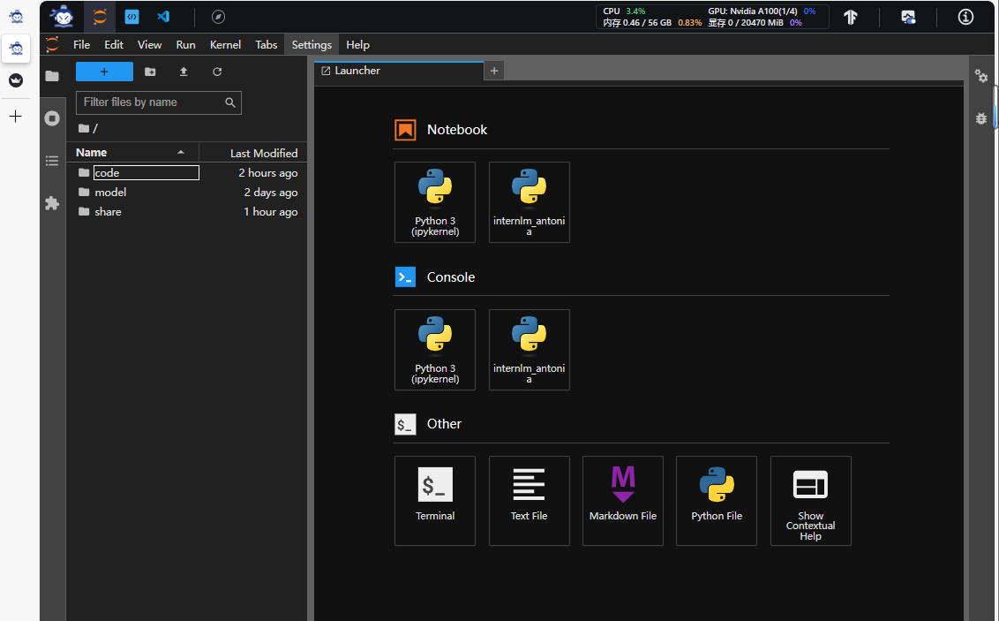
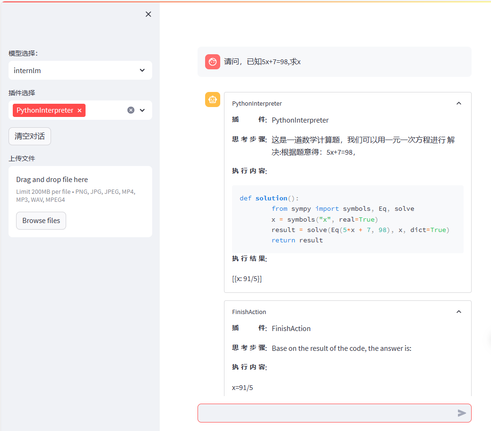
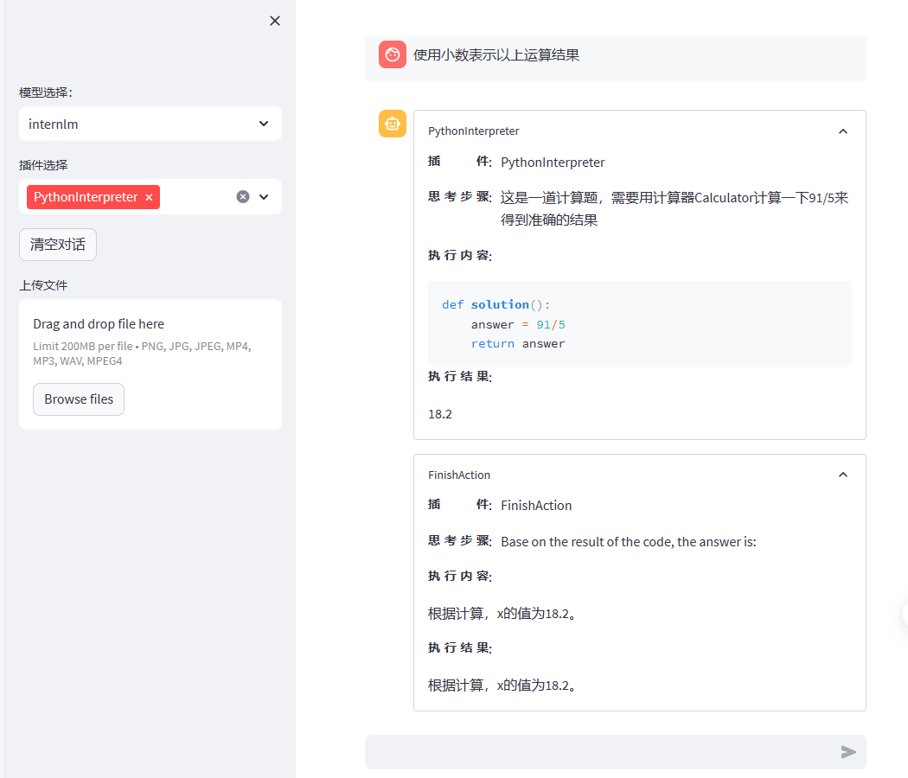

# 书生·浦语大模型Demo体验

## 环境准备

打开jupyterlab的terminal



克隆已有环境，自定义环境命名,执行如下代码
```
cd /root
conda create --name internlm_antonia --clone /root/share/install_conda_env_internlm_base.sh internlm-demo
```
激活环境
```
Conda activate internlm_antonia
```
### 安装python相关依赖

```bash
# 升级pip
python -m pip install --upgrade pip
# 安装相关依赖
pip install modelscope==1.9.5
pip install transformers==4.35.2
pip install streamlit==1.24.0
pip install sentencepiece==0.1.99
pip install accelerate==0.24.1
```
### 模型下载

平台的 `share` 目录下已经为我们准备了全系列的 `InternLM` 模型，所以我们可以直接复制。使用如下命令复制：

```shell
mkdir -p /root/model/Shanghai_AI_Laboratory
cp -r /root/share/temp/model_repos/internlm-chat-7b /root/model/Shanghai_AI_Laboratory
```
## InternLM-Chat-7B demo 实现

### 代码准备

首先 `clone` 代码，在 `/root` 路径下新建 `code` 目录，然后切换路径, clone 代码.
```shell
cd /root/code
git clone https://gitee.com/internlm/InternLM.git
```
切换 commit 版本

```shell
cd InternLM
git checkout 3028f07cb79e5b1d7342f4ad8d11efad3fd13d17
```

将 `/root/code/InternLM/web_demo.py` 中 29 行和 33 行的模型更换为本地的 `/root/model/Shanghai_AI_Laboratory/internlm-chat-7b`。

### 终端运行

在 `/root/code/InternLM` 目录下新建一个 `cli_demo.py` 文件

```bash
cd /root/code/InternLM
touch cli_demo.py && vim cli_demo.py
```

将以下代码填入其中：
```python
import torch
from transformers import AutoTokenizer, AutoModelForCausalLM


model_name_or_path = "/root/model/Shanghai_AI_Laboratory/internlm-chat-7b"

tokenizer = AutoTokenizer.from_pretrained(model_name_or_path, trust_remote_code=True)
model = AutoModelForCausalLM.from_pretrained(model_name_or_path, trust_remote_code=True, torch_dtype=torch.bfloat16, device_map='auto')
model = model.eval()

system_prompt = """You are an AI assistant whose name is InternLM (书生·浦语).
- InternLM (书生·浦语) is a conversational language model that is developed by Shanghai AI Laboratory (上海人工智能实验室). It is designed to be helpful, honest, and harmless.
- InternLM (书生·浦语) can understand and communicate fluently in the language chosen by the user such as English and 中文.
"""

messages = [(system_prompt, '')]

print("=============Welcome to InternLM chatbot, type 'exit' to exit.=============")

while True:
    input_text = input("User  >>> ")
    input_text = input_text.replace(' ', '')
    if input_text == "exit":
        break
    response, history = model.chat(tokenizer, input_text, history=messages)
    messages.append((input_text, response))
    print(f"robot >>> {response}")
```

然后在终端运行以下命令，即可体验 `InternLM-Chat-7B` 模型的对话能力

```shell
python /root/code/InternLM/cli_demo.py
```

### web demo 运行

切换到 `VScode` 中，运行 `/root/code/InternLM` 目录下的 `web_demo.py` 文件，输入以下命令后

```shell
bash
conda activate internlm_antonia
cd /root/code/InternLM
streamlit run web_demo.py --server.address 127.0.0.1 --server.port 6006
```
网页版对话，生成的故事创作结果如下：


## Lagent 智能体 Demo 实现

使用和`InternLM-Chat-7B`demo 已配置好的相同环境 

### Lagent 安装

切换路径到 `/root/code` 克隆 `lagent` 仓库，并通过 `pip install -e .` 源码安装 `Lagent`

```shell
cd /root/code
git clone https://gitee.com/internlm/lagent.git
cd /root/code/lagent
git checkout 511b03889010c4811b1701abb153e02b8e94fb5e # 尽量保证和教程commit版本一致
pip install -e . # 源码安装
```
### 需要修改的执行文件代码

将 `/root/code/lagent/examples/react_web_demo.py` 内容替换为以下代码

```python
import copy
import os

import streamlit as st
from streamlit.logger import get_logger

from lagent.actions import ActionExecutor, GoogleSearch, PythonInterpreter
from lagent.agents.react import ReAct
from lagent.llms import GPTAPI
from lagent.llms.huggingface import HFTransformerCasualLM


class SessionState:

    def init_state(self):
        """Initialize session state variables."""
        st.session_state['assistant'] = []
        st.session_state['user'] = []

        #action_list = [PythonInterpreter(), GoogleSearch()]
        action_list = [PythonInterpreter()]
        st.session_state['plugin_map'] = {
            action.name: action
            for action in action_list
        }
        st.session_state['model_map'] = {}
        st.session_state['model_selected'] = None
        st.session_state['plugin_actions'] = set()

    def clear_state(self):
        """Clear the existing session state."""
        st.session_state['assistant'] = []
        st.session_state['user'] = []
        st.session_state['model_selected'] = None
        if 'chatbot' in st.session_state:
            st.session_state['chatbot']._session_history = []


class StreamlitUI:

    def __init__(self, session_state: SessionState):
        self.init_streamlit()
        self.session_state = session_state

    def init_streamlit(self):
        """Initialize Streamlit's UI settings."""
        st.set_page_config(
            layout='wide',
            page_title='lagent-web',
            page_icon='./docs/imgs/lagent_icon.png')
        # st.header(':robot_face: :blue[Lagent] Web Demo ', divider='rainbow')
        st.sidebar.title('模型控制')

    def setup_sidebar(self):
        """Setup the sidebar for model and plugin selection."""
        model_name = st.sidebar.selectbox(
            '模型选择：', options=['gpt-3.5-turbo','internlm'])
        if model_name != st.session_state['model_selected']:
            model = self.init_model(model_name)
            self.session_state.clear_state()
            st.session_state['model_selected'] = model_name
            if 'chatbot' in st.session_state:
                del st.session_state['chatbot']
        else:
            model = st.session_state['model_map'][model_name]

        plugin_name = st.sidebar.multiselect(
            '插件选择',
            options=list(st.session_state['plugin_map'].keys()),
            default=[list(st.session_state['plugin_map'].keys())[0]],
        )

        plugin_action = [
            st.session_state['plugin_map'][name] for name in plugin_name
        ]
        if 'chatbot' in st.session_state:
            st.session_state['chatbot']._action_executor = ActionExecutor(
                actions=plugin_action)
        if st.sidebar.button('清空对话', key='clear'):
            self.session_state.clear_state()
        uploaded_file = st.sidebar.file_uploader(
            '上传文件', type=['png', 'jpg', 'jpeg', 'mp4', 'mp3', 'wav'])
        return model_name, model, plugin_action, uploaded_file

    def init_model(self, option):
        """Initialize the model based on the selected option."""
        if option not in st.session_state['model_map']:
            if option.startswith('gpt'):
                st.session_state['model_map'][option] = GPTAPI(
                    model_type=option)
            else:
                st.session_state['model_map'][option] = HFTransformerCasualLM(
                    '/root/model/Shanghai_AI_Laboratory/internlm-chat-7b')
        return st.session_state['model_map'][option]

    def initialize_chatbot(self, model, plugin_action):
        """Initialize the chatbot with the given model and plugin actions."""
        return ReAct(
            llm=model, action_executor=ActionExecutor(actions=plugin_action))

    def render_user(self, prompt: str):
        with st.chat_message('user'):
            st.markdown(prompt)

    def render_assistant(self, agent_return):
        with st.chat_message('assistant'):
            for action in agent_return.actions:
                if (action):
                    self.render_action(action)
            st.markdown(agent_return.response)

    def render_action(self, action):
        with st.expander(action.type, expanded=True):
            st.markdown(
                "<p style='text-align: left;display:flex;'> <span style='font-size:14px;font-weight:600;width:70px;text-align-last: justify;'>插    件</span><span style='width:14px;text-align:left;display:block;'>:</span><span style='flex:1;'>"  # noqa E501
                + action.type + '</span></p>',
                unsafe_allow_html=True)
            st.markdown(
                "<p style='text-align: left;display:flex;'> <span style='font-size:14px;font-weight:600;width:70px;text-align-last: justify;'>思考步骤</span><span style='width:14px;text-align:left;display:block;'>:</span><span style='flex:1;'>"  # noqa E501
                + action.thought + '</span></p>',
                unsafe_allow_html=True)
            if (isinstance(action.args, dict) and 'text' in action.args):
                st.markdown(
                    "<p style='text-align: left;display:flex;'><span style='font-size:14px;font-weight:600;width:70px;text-align-last: justify;'> 执行内容</span><span style='width:14px;text-align:left;display:block;'>:</span></p>",  # noqa E501
                    unsafe_allow_html=True)
                st.markdown(action.args['text'])
            self.render_action_results(action)

    def render_action_results(self, action):
        """Render the results of action, including text, images, videos, and
        audios."""
        if (isinstance(action.result, dict)):
            st.markdown(
                "<p style='text-align: left;display:flex;'><span style='font-size:14px;font-weight:600;width:70px;text-align-last: justify;'> 执行结果</span><span style='width:14px;text-align:left;display:block;'>:</span></p>",  # noqa E501
                unsafe_allow_html=True)
            if 'text' in action.result:
                st.markdown(
                    "<p style='text-align: left;'>" + action.result['text'] +
                    '</p>',
                    unsafe_allow_html=True)
            if 'image' in action.result:
                image_path = action.result['image']
                image_data = open(image_path, 'rb').read()
                st.image(image_data, caption='Generated Image')
            if 'video' in action.result:
                video_data = action.result['video']
                video_data = open(video_data, 'rb').read()
                st.video(video_data)
            if 'audio' in action.result:
                audio_data = action.result['audio']
                audio_data = open(audio_data, 'rb').read()
                st.audio(audio_data)


def main():
    logger = get_logger(__name__)
    # Initialize Streamlit UI and setup sidebar
    if 'ui' not in st.session_state:
        session_state = SessionState()
        session_state.init_state()
        st.session_state['ui'] = StreamlitUI(session_state)

    else:
        st.set_page_config(
            layout='wide',
            page_title='lagent-web',
            page_icon='./docs/imgs/lagent_icon.png')
        # st.header(':robot_face: :blue[Lagent] Web Demo ', divider='rainbow')
    model_name, model, plugin_action, uploaded_file = st.session_state[
        'ui'].setup_sidebar()

    # Initialize chatbot if it is not already initialized
    # or if the model has changed
    if 'chatbot' not in st.session_state or model != st.session_state[
            'chatbot']._llm:
        st.session_state['chatbot'] = st.session_state[
            'ui'].initialize_chatbot(model, plugin_action)

    for prompt, agent_return in zip(st.session_state['user'],
                                    st.session_state['assistant']):
        st.session_state['ui'].render_user(prompt)
        st.session_state['ui'].render_assistant(agent_return)
    # User input form at the bottom (this part will be at the bottom)
    # with st.form(key='my_form', clear_on_submit=True):

    if user_input := st.chat_input(''):
        st.session_state['ui'].render_user(user_input)
        st.session_state['user'].append(user_input)
        # Add file uploader to sidebar
        if uploaded_file:
            file_bytes = uploaded_file.read()
            file_type = uploaded_file.type
            if 'image' in file_type:
                st.image(file_bytes, caption='Uploaded Image')
            elif 'video' in file_type:
                st.video(file_bytes, caption='Uploaded Video')
            elif 'audio' in file_type:
                st.audio(file_bytes, caption='Uploaded Audio')
            # Save the file to a temporary location and get the path
            file_path = os.path.join(root_dir, uploaded_file.name)
            with open(file_path, 'wb') as tmpfile:
                tmpfile.write(file_bytes)
            st.write(f'File saved at: {file_path}')
            user_input = '我上传了一个图像，路径为: {file_path}. {user_input}'.format(
                file_path=file_path, user_input=user_input)
        agent_return = st.session_state['chatbot'].chat(user_input)
        st.session_state['assistant'].append(copy.deepcopy(agent_return))
        logger.info(agent_return.inner_steps)
        st.session_state['ui'].render_assistant(agent_return)


if __name__ == '__main__':
    root_dir = os.path.dirname(os.path.dirname(os.path.abspath(__file__)))
    root_dir = os.path.join(root_dir, 'tmp_dir')
    os.makedirs(root_dir, exist_ok=True)
    main()
```

### Lagent Demo 运行

进入VScode，打开terminal，执行如下命令

```shell
streamlit run /root/code/lagent/examples/react_web_demo.py --server.address 127.0.0.1 --server.port 6006
```
在 `Web` 页面选择 `InternLM` 模型，等待模型加载完毕后，输入自定义提出的数学问题，结果如下：





